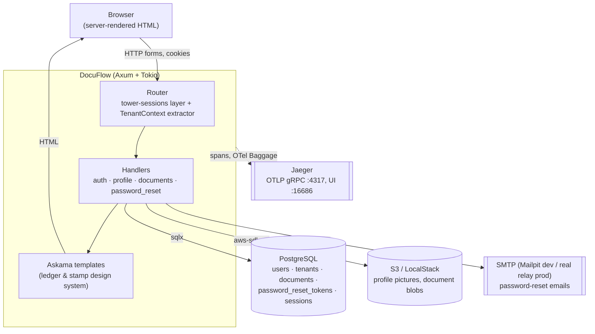
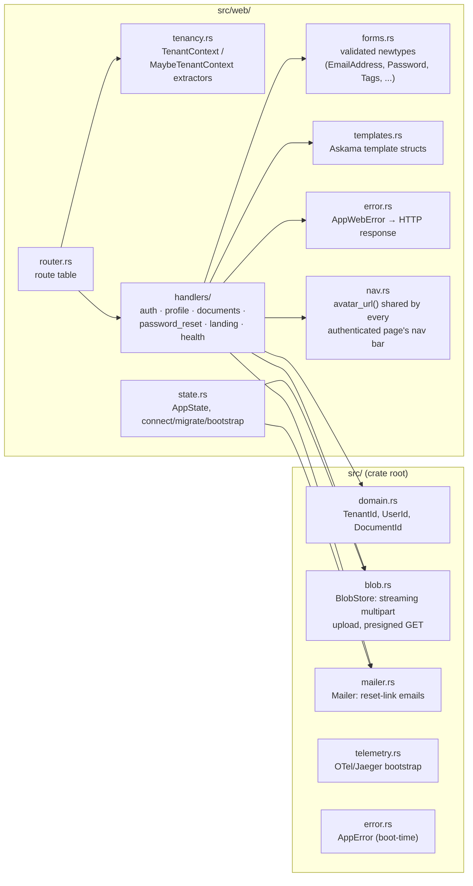
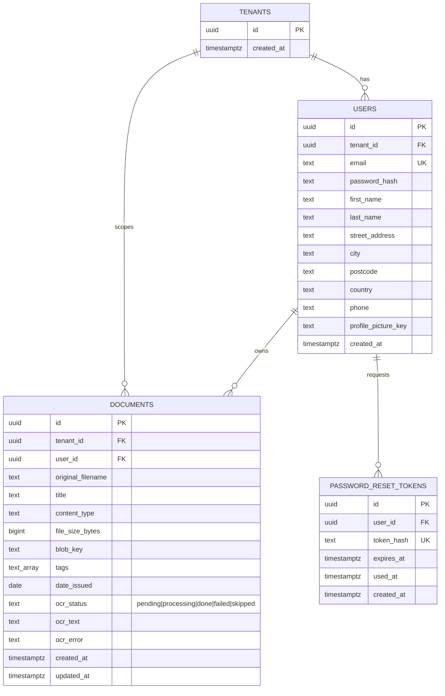

# DocuFlow Architecture

Living reference for the system as a whole — components, interfaces,
frameworks, schema, and the load-bearing decisions behind them. Per-feature
rationale in full (alternatives considered, pros/cons) lives in
[`docs/tdr/`](tdr/); this document summarizes and links out rather than
duplicating it. Update this file whenever a feature changes a component
boundary, adds a table, or reverses an earlier decision — it should always
describe the system as it is today, not as it was designed.

## 1. System context

Everything is server-rendered — no client-side app framework or JSON API;
handlers return HTML (Askama templates) or a redirect.

## 2. Core stack

| Concern | Choice | Notes |
|---|---|---|
| Web runtime | Axum 0.7 + Tokio | pins `matchit` 0.7's `:param` route syntax, **not** axum 0.8's `{param}` — see [Gotchas](#6-known-gotchas) |
| Templates | Askama 0.14 + `askama_web` | compile-time-checked `.html` templates in `templates/` |
| Database | PostgreSQL + SQLx 0.8 | compile-time verified queries (`sqlx::query!`/`query_as!`); offline cache in `.sqlx/` |
| Sessions | `tower-sessions` + `tower-sessions-sqlx-store` | Postgres-backed server-side sessions; self-migrates its own table |
| Auth | `argon2` | password hashing only — no OAuth/SSO yet |
| Blob storage | `aws-sdk-s3` against LocalStack (dev) / real S3 (prod) | same code path both ways, chosen via env vars only |
| Mail | `lettre` over SMTP | Mailpit in dev, real relay in prod, selected by `SMTP_INSECURE` |
| Telemetry | `tracing` + `tracing-opentelemetry` + OTLP/gRPC → Jaeger | see [§5](#5-telemetry) |
| Errors | `thiserror`, two-tier: `AppError` (boot) / `AppWebError` (request) | zero `.unwrap()`/`.expect()`/`panic!()` in request-handling code, per CLAUDE.md |
| Version control | Jujutsu (`jj`), colocated git backend | never `git add` directly — see `docs/` environment notes in project memory |

## 3. Components

- **`router.rs`** splits routes into a `pages` group (public) and a
  `protected` group. `protected` has `TenantContext` mounted as
  `route_layer` middleware — structural enforcement, not a per-handler
  convention (a new protected route can't accidentally ship
  unauthenticated even if its handler forgets to name `TenantContext` as a
  parameter).
- **`tenancy.rs`** is the one place a request's identity is established.
  `TenantContext` hard-rejects (redirect to `/login`) when there's no
  session; `MaybeTenantContext` is the soft counterpart used on public
  pages just to decide what the nav bar shows.
- **`forms.rs`** hand-rolls validation newtypes (`TryFrom<String>`) rather
  than adopting a validation-framework crate — deliberate, see TDR 003 §2
  (Alternatives G/H/I).
- **`nav.rs`** centralizes the avatar-lookup-and-presign logic so every
  template struct across five+ handlers doesn't reimplement it.

## 4. Database schema

Notes:
- **Tenancy is 1:1 today**: signup mints one `tenants` row and one `users`
  row sharing a single UUID in one transaction. `TenantId`/`UserId` stay
  distinct Rust types anyway (per CLAUDE.md's type-driven-constraints
  rule), so a future many-users-per-tenant migration only has to relax an
  invariant, not reshape the schema or retrofit types across the codebase.
  Full alternatives considered: TDR 003 §2 (Alternatives D/E/F).
- `documents.tags` is a native Postgres `text[]` with a GIN index
  (`documents_tags_idx`), queried via the `&&` (overlap) operator — chosen
  over a join table for simplicity at current scale.
- `documents`'s `ocr_status`/`ocr_text`/`ocr_error` columns were added in
  Feature 1 (the `/documents` list/detail page) even though upload + OCR
  (Feature 2) isn't built yet — deliberately front-loaded so Feature 2
  doesn't require a schema migration, just a writer for columns that
  already exist.
- A session table also lives in this database, but it's owned and
  self-migrated by `tower-sessions-sqlx-store` (`PostgresStore::migrate()`)
  — it has no entry under `migrations/` and no corresponding Rust struct.
- ⚠️ **The integration test suite runs against this same database**
  (`DATABASE_URL`, defaults to `localhost:5432/doc_manager_db`) and
  truncates `users`/`tenants` (cascading to everything FK'd off them) at
  the start of every test. Running `cargo test` against a dev stack with
  real signed-up accounts wipes them. No isolation exists between "the dev
  database" and "the test database" today — worth fixing if this keeps
  causing surprises.

## 5. Telemetry

- `tracing` + `tracing-opentelemetry` export spans via OTLP/gRPC to Jaeger
  (`:4317` ingest, `:16686` UI).
- `tenant.id`/`user.id` are set as **span attributes** (not raw OTel
  Baggage) inside `TenantContext::from_user_id` — Baggage's `Context` guard
  is `!Send` and unsound to hold across an async handler's `.await` points
  on a multi-threaded runtime, and raw Baggage propagation alone doesn't
  surface as visible Jaeger tags without an extra baggage-to-span-attribute
  processor anyway. Every span nested under the `protected` router
  inherits these attributes automatically.
- PII (payment values, contract text, raw file bytes) is kept out of spans
  by convention: `#[tracing::instrument(skip(...))]` on any handler/method
  taking such a parameter, plus manually-redacted `Debug` impls on
  sensitive newtypes (`Password`, etc.).

## 6. Known gotchas

Operational quirks worth knowing before debugging something that looks
like a code bug but isn't — kept here since they're about the deployed
system, not any one feature's design.

- **axum 0.7 / matchit 0.7 route syntax is `:id`, not `{id}`.** Using the
  axum-0.8-style `{id}` silently 404s for everyone (owner included) instead
  of failing to compile — caught once already in `router.rs` for
  `/documents/:id`.
- **`cargo test` truncates the shared dev database** — see schema notes
  above.
- **`/static` assets are cached `immutable, max-age=31536000`** by the
  Docker image's response headers — a hard refresh (not just a normal
  reload) is required to see CSS/template changes reflected after a
  rebuild.
- **Docker doesn't pick up source changes automatically** — rebuild with
  `docker compose build app && docker compose up -d app` after any change
  before manual verification.
- **`SQLX_OFFLINE=true` Docker builds only compile the release bin**, not
  test binaries — `cargo sqlx prepare --workspace` (no `--tests`) is
  sufficient for the image to build; test binaries run online against a
  live `DATABASE_URL` instead.

## 7. Feature-by-feature decision log

Full write-ups (alternatives evaluated, pros/cons, OTel implications) are
in `docs/tdr/`; this is an index with the one-line "why" for each, newest
first.

| Feature | TDR | Chosen approach | Why (one line) |
|---|---|---|---|
| Documents dashboard (list/search/sort/edit) | *(no TDR yet — implemented directly from an approved plan)* | Literal per-sort-mode `sqlx::query_as!` (5 branches) rather than a dynamically built `ORDER BY` | Preserves CLAUDE.md's compile-time-verified-query guarantee; accepted some duplication as the tradeoff |
| Forgot / reset password | [006](tdr/006_forgot_password_design.md) | Single-use hashed token in `password_reset_tokens`, emailed via Mailpit/SMTP | Standard token-invalidation semantics; avoids storing raw tokens at rest |
| Authenticated nav (avatar, logout) | [004](tdr/004_authenticated_nav_design.md) | `nav.rs` shared avatar-lookup helper reused by every template struct | One presign/lookup path instead of five duplicated ones |
| User profile + S3 picture upload | [005](tdr/005_user_profile_design.md) | Streaming multipart → S3 multipart upload API, presigned GET for display | Bounded memory regardless of file size; bucket never made public |
| Postgres-backed auth, sessions, tenancy | [003](tdr/003_auth_persistence_design.md) | `tower-sessions` + `tower-sessions-sqlx-store`; 1:1 `tenants`/`users` from day one | Server-side revocable sessions (a signed cookie alone can't support logout invalidation); tenancy type distinction cheap now, expensive to retrofit later |
| Landing page + OTel bootstrap | [000](tdr/000_landing_page_design.md)–[002](tdr/002_landing_page_html_design.md) | Askama server-rendered HTML; OTLP/gRPC to Jaeger from process start | Establishes the design system and telemetry pipeline before any feature needs either |

## 8. Deferred / future work

Explicitly scoped out of what's built so far, to avoid being mistaken for
gaps:
- **Document upload** (regular file upload + OCR pipeline) — schema is
  ready (`ocr_status` et al.), handler/UI not yet built.
- **Phone-camera scanning** (cross-device QR handoff) — deliberately split
  from upload as its own feature per explicit product direction, not
  started.
- **Multi-user tenants** (invite flow, membership roles) — schema/types
  already distinguish `TenantId`/`UserId` in anticipation, but no UI or
  membership table exists.
