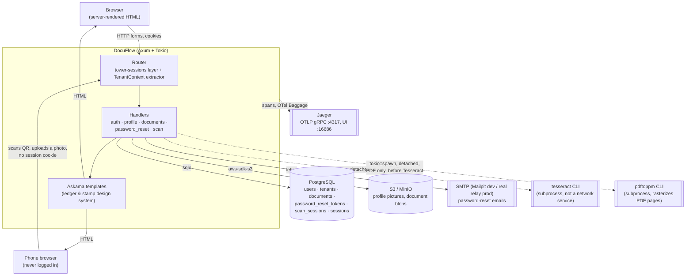
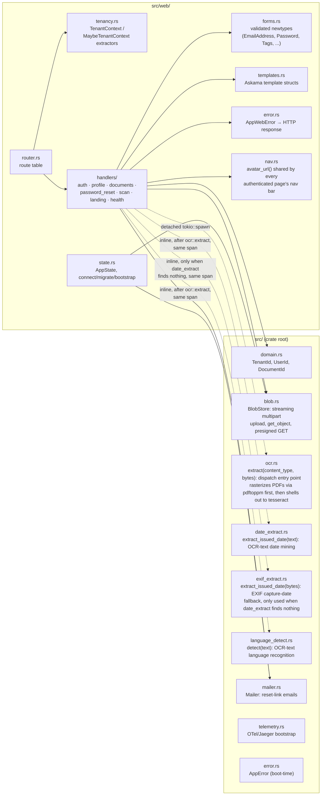

# DocuFlow Architecture

Living reference for the system as a whole — components, interfaces,
frameworks, schema, and the load-bearing decisions behind them. Per-feature
rationale in full (alternatives considered, pros/cons) lives in
[`docs/tdr/`](tdr/); this document summarizes and links out rather than
duplicating it. Update this file whenever a feature changes a component
boundary, adds a table, or reverses an earlier decision — it should always
describe the system as it is today, not as it was designed.

## 1. System context

Everything is server-rendered — no client-side app framework or JSON API;
handlers return HTML (Askama templates) or a redirect. The phone side of
feature 009's scan handoff is no exception: it's another server-rendered
page, just one reached without a session cookie (see §3/§4 below).

## 2. Core stack

| Concern | Choice | Notes |
|---|---|---|
| Web runtime | Axum 0.7 + Tokio | pins `matchit` 0.7's `:param` route syntax, **not** axum 0.8's `{param}` — see [Gotchas](#6-known-gotchas) |
| Templates | Askama 0.14 + `askama_web` | compile-time-checked `.html` templates in `templates/` |
| Database | PostgreSQL + SQLx 0.8 | compile-time verified queries (`sqlx::query!`/`query_as!`); offline cache in `.sqlx/` |
| Sessions | `tower-sessions` + `tower-sessions-sqlx-store` | Postgres-backed server-side sessions; self-migrates its own table |
| Auth | `argon2` | password hashing only — no OAuth/SSO yet |
| Blob storage | `aws-sdk-s3` against MinIO (dev) / real S3 (prod) | same code path both ways, chosen via env vars only; MinIO replaced LocalStack 2026-07-13 — LocalStack Community's `PERSISTENCE=1` never actually persisted S3 object data across restarts (verified empirically), MinIO's does |
| OCR | `tesseract` CLI via `tokio::process::Command`, always `-l eng+deu+nld+ukr` | shelled out, not an FFI crate — `tesseract-ocr` + `tesseract-ocr-deu`/`-nld`/`-ukr` apt packages in `Dockerfile`'s runtime stage (Russian pack retired 2026-07-13), zero new Cargo dependency; multi-language mode picks the right trained data per block with no per-document language selection needed to run OCR itself — see TDR 011, widened by TDR 020 |
| Language detection | `whatlang` crate, restricted to the 4 OCR-supported languages | pure Rust, no system dependency; populates `documents.language` from `ocr_text`, never proposing a code OCR wasn't tuned for — see TDR 014, generalized by TDR 020 |
| Language validation/naming | `isolang` crate, full ISO 639-1 table | backs `documents.language`'s open-ended "any language" tagging (`src/languages.rs`) independently of which languages OCR itself supports — see TDR 020 |
| Repeated query params | `axum-extra`'s `Query` (backed by `serde_html_form`), only on `/documents`'s facet params | `axum::extract::Query` (`serde_urlencoded`) can't collect `tags=a&tags=b` into a `Vec<String>` — see TDR 015 §3; every other route keeps the standard `axum::extract::Query`. Feature 016 also depends on `serde_html_form` directly (pinned to the same version) to parse a saved collection's stored query string the same way. |
| EXIF reading | `kamadak-exif` crate, `DateTimeOriginal`/`DateTime` tags only | pure Rust EXIF reader; feeds `ocr_suggested_date_issued` as a fallback when OCR text has no recognizable date — see TDR 019 |
| PDF rasterization | `pdftoppm` (`poppler-utils`) CLI via `tokio::process::Command` | same "shell out, don't link" precedent as `tesseract`; rasterizes each page to a PNG, then each page goes through the existing image-OCR path — see TDR 010 |
| QR codes | `qrcode` crate, `svg` feature only | pure Rust, no system dependency; renders inline `<svg>` colored via `var(--ink)`/`var(--paper-raised)` so it follows the page's theme |
| Mail | `lettre` over SMTP | Mailpit in dev, real relay in prod, selected by `SMTP_INSECURE` |
| Telemetry | `tracing` + `tracing-opentelemetry` + OTLP/gRPC → Jaeger | see [§5](#5-telemetry) |
| Errors | `thiserror`, two-tier: `AppError` (boot) / `AppWebError` (request) | zero `.unwrap()`/`.expect()`/`panic!()` in request-handling code, per CLAUDE.md |
| Version control | Jujutsu (`jj`), colocated git backend | never `git add` directly — see `docs/` environment notes in project memory |

## 3. Components

- **`router.rs`** splits routes into a `pages` group (public) and a
  `protected` group. `protected` has `TenantContext` mounted as
  `route_layer` middleware — structural enforcement, not a per-handler
  convention (a new protected route can't accidentally ship
  unauthenticated even if its handler forgets to name `TenantContext` as a
  parameter).
- **`tenancy.rs`** is the one place a request's identity is established.
  `TenantContext` hard-rejects (redirect to `/login`) when there's no
  session; `MaybeTenantContext` is the soft counterpart used on public
  pages just to decide what the nav bar shows.
- **`forms.rs`** hand-rolls validation newtypes (`TryFrom<String>`) rather
  than adopting a validation-framework crate — deliberate, see TDR 003 §2
  (Alternatives G/H/I).
- **`nav.rs`** centralizes the avatar-lookup-and-presign logic so every
  template struct across five+ handlers doesn't reimplement it.
- **`handlers::documents::list`** (feature 015) also computes the smart
  filters panel's facet options alongside the main, facet-aware,
  per-sort-mode `query_as!` calls. Each facet option's *candidate set*
  (which tags/years exist at all) stays the tenant's unfiltered full set,
  but each option's displayed *count* is narrowed by whichever other
  facets are currently active (feature 018) — one `count_documents` call
  per candidate, with that facet's own dimension pinned to just that one
  value (TDR 018 §3).
- **`handlers::documents::{save_collection, delete_collection,
  rename_collection}`** (features 016/017) round out the smart-filters
  batch — a saved collection is just a named bookmark of a
  `/documents?...` query string, applied by reusing `list`'s own parsing
  (`ListQuery`, via `serde_html_form`) with no separate filter-matching
  code. `count_documents` (extracted from feature 016's
  `count_matching_documents` when feature 018 needed the same `WHERE`
  clause for per-facet-option counts too) is the one shared "does this
  document match this filter combination" query both features build on.
- **`handlers/scan.rs`** (feature 009) is the one place a request reaches a
  document-creating handler *without* going through the `TenantContext`
  extractor — `GET /scan/:token` and `POST /scan/:token` sit in the public
  `pages` router group (a phone never has a session cookie), and resolve
  tenancy from the `scan_sessions` row a hashed path token matches instead.
  `handlers::documents` exposes `store_and_queue_ocr`/
  `insert_document_and_queue_ocr` (split so `documents::create`'s
  "metadata after the file field is rejected" guarantee still holds) as the
  shared blob-upload-plus-DB-insert-plus-OCR-spawn core both this and the
  desktop `POST /documents` handler call — one pipeline, two entry points.

## 4. Database schema

```mermaid
erDiagram
    TENANTS ||--o{ USERS : "has"
    TENANTS ||--o{ DOCUMENTS : "scopes"
    TENANTS ||--o{ SMART_COLLECTIONS : "scopes"
    USERS ||--o{ DOCUMENTS : "owns"
    USERS ||--o{ PASSWORD_RESET_TOKENS : "requests"
    USERS ||--o{ SCAN_SESSIONS : "requests"
    DOCUMENTS |o--o| SCAN_SESSIONS : "created by"
    SCAN_SESSIONS ||--o{ SCAN_PAGES : "accumulates (feature 022)"

    TENANTS {
        uuid id PK
        timestamptz created_at
    }
    USERS {
        uuid id PK
        uuid tenant_id FK
        text email UK
        text password_hash
        text first_name
        text last_name
        text street_address
        text city
        text postcode
        text country
        text phone
        text profile_picture_key
        timestamptz created_at
    }
    PASSWORD_RESET_TOKENS {
        uuid id PK
        uuid user_id FK
        text token_hash UK
        timestamptz expires_at
        timestamptz used_at
        timestamptz created_at
    }
    DOCUMENTS {
        uuid id PK
        uuid tenant_id FK
        uuid user_id FK
        text original_filename
        text title
        text content_type
        bigint file_size_bytes
        text blob_key
        text_array tags
        date date_issued
        date ocr_suggested_date_issued "feature 012, nullable"
        text ocr_status "pending|processing|done|failed|skipped"
        text ocr_text
        tsvector ocr_search "feature 023, generated from ocr_text, GIN-indexed"
        text ocr_error
        text language "feature 014, nullable, any ISO 639-1 code (feature 020)"
        text doc_type "feature 024, nullable, open text (fixed <select> options)"
        text ocr_suggested_doc_type "feature 024, nullable"
        text thumbnail_status "feature 025, nullable, pending|done|failed"
        timestamptz created_at
        timestamptz updated_at
    }
    SCAN_SESSIONS {
        uuid id PK
        uuid tenant_id FK
        uuid user_id FK
        text token_hash UK
        text status "pending|capturing|captured (capturing: feature 022)"
        uuid document_id FK "nullable until captured"
        timestamptz expires_at "slides +10min per captured page (feature 022)"
        timestamptz created_at
    }
    SCAN_PAGES {
        uuid id PK
        uuid scan_session_id FK
        int page_number "unique per session, capture order"
        text blob_key "page blob; deleted best-effort on finalize"
        text content_type
        bigint file_size_bytes
        timestamptz created_at
    }
    SMART_COLLECTIONS {
        uuid id PK
        uuid tenant_id FK
        text name
        text query "feature 016, raw /documents query string"
        timestamptz created_at
    }
```

Notes:
- **Tenancy is 1:1 today**: signup mints one `tenants` row and one `users`
  row sharing a single UUID in one transaction. `TenantId`/`UserId` stay
  distinct Rust types anyway (per CLAUDE.md's type-driven-constraints
  rule), so a future many-users-per-tenant migration only has to relax an
  invariant, not reshape the schema or retrofit types across the codebase.
  Full alternatives considered: TDR 003 §2 (Alternatives D/E/F).
- `documents.tags` is a native Postgres `text[]` with a GIN index
  (`documents_tags_idx`), queried via the `&&` (overlap) operator — chosen
  over a join table for simplicity at current scale.
- `documents`'s `ocr_status`/`ocr_text`/`ocr_error` columns were added in
  Feature 1 (the `/documents` list/detail page) ahead of Feature 2 (upload
  + OCR, now built) needing them, so Feature 2 required no schema
  migration — just a writer for columns that already existed. All five
  accepted content types (`image/jpeg`/`png`/`tiff`/`webp` and, since
  feature 010, `application/pdf`) go through `'pending'` → `'processing'`
  → `'done'`/`'failed'`; `'skipped'` is now only a historical value for
  PDF rows uploaded before feature 010 shipped (never assigned to new
  uploads). `ocr_suggested_date_issued` (feature 012) is written
  alongside `ocr_text` on a successful OCR pass, independent of
  `date_issued` — see TDR 012 and §7 below.
- `scan_sessions` (feature 009) follows `password_reset_tokens`'s shape —
  only `token_hash` is ever persisted, never the raw token embedded in the
  QR code. Unlike `password_reset_tokens`, expiry (`expires_at`, a fixed
  10-minute TTL from creation) is enforced entirely in each query's `WHERE`
  clause (`status = 'captured' or expires_at > now()`) rather than compared
  against `time::OffsetDateTime::now_utc()` in Rust, avoiding any
  app/DB-clock-skew concern. `document_id` is `null` until a phone actually
  captures a photo, at which point it and `status = 'captured'` are set
  together in the same `UPDATE` — `handlers::scan` treats "captured but no
  `document_id`" as an invariant violation (`AppWebError::
  InconsistentScanSession`) rather than something that can legitimately
  happen.
- `smart_collections.query` (feature 016) stores the raw `/documents`
  query string a saved collection bookmarks — deliberately not decomposed
  into structured `tags`/`date_year`/`lang`/... columns, so it reuses
  `list`'s existing parsing/validation with no second representation of
  "what a filter is" to keep in sync (see TDR 016 §2). A collection's
  displayed document count is always computed live against this stored
  query at render time, never cached on the row.
- A session table also lives in this database, but it's owned and
  self-migrated by `tower-sessions-sqlx-store` (`PostgresStore::migrate()`)
  — it has no entry under `migrations/` and no corresponding Rust struct.
- The integration test suite runs against its **own** `doc_manager_db_test`
  database (`tests/common/mod.rs::test_database_url`, override with
  `TEST_DATABASE_URL`) — created automatically on first run, on the same
  Postgres server as dev but deliberately never derived from `DATABASE_URL`.
  Tests truncate `users`/`tenants` (cascading to everything FK'd off them)
  at the start of every test, but only in this dedicated database — a
  `cargo test` run can no longer wipe real signed-up accounts sitting in
  the dev/Docker-deployed database. (This used to be a single shared
  database — fixed after it caused exactly that data loss during this
  project's Feature 2 development.)

## 5. Telemetry

- `tracing` + `tracing-opentelemetry` export spans via OTLP/gRPC to Jaeger
  (`:4317` ingest, `:16686` UI) — **only when `OTLP_ENDPOINT` is set**
  (feature 021). Unset (or empty) means no exporter is constructed at all:
  the mode a pulled image runs in on a host with no collector. Dev setups
  set it explicitly (`.cargo/config.toml`, `.env`, `docker-compose.yml`);
  there is no in-code `localhost:4317` fallback anymore.
- A `fmt` stdout layer is always installed regardless of `OTLP_ENDPOINT`
  (feature 021), so `docker logs` works on collector-less deployments. It
  subscribes to the same sanitized event stream the OTel layer exports —
  no separate PII surface.
- `tenant.id`/`user.id` are set as **span attributes** (not raw OTel
  Baggage) inside `TenantContext::from_user_id` — Baggage's `Context` guard
  is `!Send` and unsound to hold across an async handler's `.await` points
  on a multi-threaded runtime, and raw Baggage propagation alone doesn't
  surface as visible Jaeger tags without an extra baggage-to-span-attribute
  processor anyway. Every span nested under the `protected` router
  inherits these attributes automatically.
- PII (payment values, contract text, raw file bytes) is kept out of spans
  by convention: `#[tracing::instrument(skip(...))]` on any handler/method
  taking such a parameter, plus manually-redacted `Debug` impls on
  sensitive newtypes (`Password`, etc.).

## 6. Known gotchas

Operational quirks worth knowing before debugging something that looks
like a code bug but isn't — kept here since they're about the deployed
system, not any one feature's design.

- **axum 0.7 / matchit 0.7 route syntax is `:id`, not `{id}`.** Using the
  axum-0.8-style `{id}` silently 404s for everyone (owner included) instead
  of failing to compile — caught once already in `router.rs` for
  `/documents/:id`.
- **`cargo test` used to truncate the shared dev database** — fixed, see
  schema notes above (dedicated `doc_manager_db_test`). The blob-storage
  equivalent of this same bug (`tests/common/mod.rs::test_state()`
  building its `BlobStore` from the environment, i.e. the real dev
  bucket, instead of an isolated test bucket) existed until 2026-07-13 —
  now overridden to `docuflow-uploads-test` right after `state::connect`.
  If a future test-isolation gap turns up, check *both* halves
  (`AppState`'s pool and its blob store) rather than assuming fixing one
  covers the other.
- **A `<form>` nested inside another `<form>` is invalid HTML that
  `curl`/endpoint-level tests can't catch.** Found 2026-07-13 in
  `document_show.html`'s "Use this date" button, present since feature
  012: real browsers drop a nested `<form>`'s opening tag but still
  process its closing tag against the *outer* form, ending it early —
  everything rendered afterward (in that case, the Language field and
  "Save changes" button) ends up outside any form, silently inert.
  Fixed with the `formaction`/`formmethod`/`formnovalidate`
  button-override pattern features 016/017 already used. Whenever a page
  gets a second action alongside an existing form, grep the template for
  `<form` — there should be exactly one, covering that whole region.
- **`/static` assets are cached `immutable, max-age=31536000`** by the
  Docker image's response headers — a hard refresh (not just a normal
  reload) is required to see CSS/template changes reflected after a
  rebuild.
- **Docker doesn't pick up source changes automatically** — rebuild with
  `docker compose build app && docker compose up -d app` after any change
  before manual verification.
- **`SQLX_OFFLINE=true` Docker builds only compile the release bin**, not
  test binaries — `cargo sqlx prepare --workspace` (no `--tests`) is
  sufficient for the image to build; test binaries run online against a
  live database instead (see the dedicated test database note above).
- **A document's OCR pass can get stuck at `ocr_status = 'processing'`**
  if the app restarts mid-job — axum's graceful shutdown only drains
  in-flight HTTP connections, not the detached `tokio::spawn` task running
  `tesseract`. `state::migrate` sweeps any `'processing'` row back to
  `'pending'` on boot, but that only clears the stuck flag; there's no
  retry yet, so a swept row just sits at `'pending'` until a future retry
  feature exists. This also assumes a single running instance — it would
  incorrectly steal another live instance's in-flight row if this app is
  ever horizontally scaled.
- **`/scan/:token` is deliberately outside the `protected` router group** —
  don't "fix" this by moving it under `TenantContext`'s `route_layer`; the
  phone loading it is never logged in, by design (see TDR 009). Tenancy for
  those two routes comes from the `scan_sessions` row the path token
  resolves to, checked by hand inside `handlers::scan`.
- **`tesseract-ocr`, (since feature 010) `poppler-utils`, and (since
  feature 011, widened by feature 020) `tesseract-ocr-deu`/`-nld`/`-ukr`
  are host/system dependencies, not Cargo ones** — the Docker runtime
  image installs all of them via `apt-get` (see `Dockerfile`), so the
  containerized app needs nothing extra. Anyone running the app or `cargo
  test`/`cargo run` *outside* Docker needs `tesseract-ocr`,
  `tesseract-ocr-deu`/`-nld`/`-ukr`, and `poppler-utils` (for its
  `pdftoppm` binary) installed on their own machine, or the relevant
  document-upload OCR tests soft-skip (checks `which tesseract`/
  `which pdftoppm`, and per-language, whether `tesseract --list-langs`
  includes `deu`/`nld`/`ukr`) and any real upload's `ocr_status` will sit
  at `'processing'`/never advance, or German/Dutch/Ukrainian text will OCR
  as garbled guesses instead of failing outright. On a host without `sudo`
  (no `apt-get install` possible), a `TESSDATA_PREFIX` pointed at a
  scratch directory with the relevant `*.traineddata` files downloaded
  from `tessdata_fast` works too — see feature 011's precedent for this
  same workaround.

## 7. Feature-by-feature decision log

Full write-ups (alternatives evaluated, pros/cons, OTel implications) are
in `docs/tdr/`; this is an index with the one-line "why" for each, newest
first.

| Feature | TDR | Chosen approach | Why (one line) |
|---|---|---|---|
| Duplicate detection | [029](tdr/029_duplicate_detection_design.md) | Hex-SHA-256 `documents.content_hash`, computed synchronously at upload time for both ingestion paths (`BlobStore::stream_upload_with_hash`'s same-pass loop; a direct digest of the scan path's already-in-memory PDF bytes); `run_ocr` backfills it on every reprocess; `show()` does a live "oldest other match?" lookup whenever `uploaded=true`, no new query param needed | Never blocks the upload, only warns (matches this app's suggestion-based philosophy); gating the lookup on the existing `uploaded` flag makes both ingestion paths and the one-shot-never-again rule fall out for free (TDR 029 §2-3) |
| *Codebase health: facet-scaffolding refactor (not a user feature)* | [028](tdr/028_facet_module_refactor_design.md) | New `src/web/facets.rs`: `ActiveFilters` normalizes `ListQuery` once (replacing 3 parallel shapes of the same state); `assemble_facet_options` collapses 5 hand-copied "discover → narrow-count → mark checked → push" loops into one pure, unit-tested function | An architecture review found `documents.rs` (1964 lines, touched by nearly every feature since 012) had grown 5 shallow near-copies with no seam testable without Postgres/axum (TDR 028 §1-3) |
| Bulk actions on the dashboard | [026](tdr/026_bulk_dashboard_actions_design.md) | Row checkboxes + a toolbar inside the existing single filters `<form>` via `formaction`/`formmethod` (never a second nested form); `axum_extra::extract::Form` for the repeated `doc_ids`; bulk delete gets a confirm page, bulk tag/reprocess don't; reprocess reuses `reprocess_ocr`'s exact eligibility guard and the existing `state.ocr_semaphore` | Avoids this project's own documented nested-`<form>` bug; the semaphore already bounds concurrent OCR regardless of how many rows are bulk-spawned, closing §8's bulk-reprocess gap with no new batching logic (TDR 026 §2 Alternative E) |
| Dashboard thumbnails + side-by-side preview | [025](tdr/025_thumbnails_and_preview_design.md) | Thumbnail generated inside the existing `run_ocr` background task, reusing bytes it already has (original image bytes, or a PDF's already-rasterized page 1) via new `src/thumbnail.rs`; `documents.thumbnail_status` mirrors `ocr_status`'s pattern; `document_show.html`'s preview/OCR-text cards become side-by-side siblings instead of one stacked column | No new blob fetch or second PDF rasterization pass — `run_ocr` already has the needed bytes in memory (TDR 025 §2 Alternative A) |
| Auto-classification / document type | [024](tdr/024_doc_type_classification_design.md) | Keyword-rule scan of `ocr_text` (`src/doc_type_extract.rs`) writes `ocr_suggested_doc_type`, mirroring feature 012's suggest-then-confirm split with `doc_type`; facet shape mirrors `language` (open string, multi-select, `"unset"` option), not the single-active-value date facet | A wrong guess must never land silently (TDR 012 precedent); `doc_type` is structurally an OR-multi-select facet like `language`, not a single-value one like `date_issued` (TDR 024 §2-3) |
| Full-text search over OCR'd document text | [023](tdr/023_fulltext_ocr_search_design.md) | Generated `documents.ocr_search tsvector` column (`'simple'` config, not `'english'`) + GIN index; the existing search box's `q` gains a second OR'd condition — `ocr_search @@ websearch_to_tsquery('simple', q)` alongside the existing tag overlap | `'simple'` avoids misleadingly stemming German/Dutch/Ukrainian/Cyrillic OCR text as if it were English (feature 020); one OR'd condition on the existing box needs no new params, facets, or template changes (TDR 023 §2-3) |
| Multi-page phone scan | [022](tdr/022_multipage_scan_design.md) | One scan session accumulates pages (`scan_pages` + `'capturing'` status, sliding 10-min expiry per page); `POST /scan/:token/finish` assembles them into one PDF via pure-Rust `lopdf`+`image` (`src/pdf_assemble.rs`, JPEG passthrough, page box at 72/150ths of pixels) and pushes it through the existing ingest path | N photos must become *one* archive entry, and a PDF makes feature 010's per-page OCR work unchanged; pure-Rust assembly follows the `qrcode` no-system-dependency precedent over dragging Python (`img2pdf`) into the image (TDR 022 §2) |
| Nightly image shipping (GHCR pipeline + self-host deploy) | [021](tdr/021_nightly_image_shipping_design.md) | GitHub Actions nightly: full `cargo check`/`cargo test` gate, then push `ghcr.io/yaremam/docuflow` (`nightly` / `nightly-YYYY-MM-DD` / `sha-*`, amd64 only), skipping via the published image's revision label; telemetry made opt-in (`OTLP_ENDPOINT` unset → stdout `fmt` logs only); `deploy/docker-compose.yml` is the user-facing artifact | An image tag existing must *imply* its commit passed the suite (CLAUDE.md's CI rule as machinery), and "absence of config" is what a fresh pull runs with — so absence has to be the safe telemetry mode (TDR 021 §2-3) |
| General language support (German/Dutch/Ukrainian OCR, full-world tagging) | [020](tdr/020_general_language_support_design.md) | `documents.language` opened to any ISO 639-1 code (validated via `isolang`, not a CHECK enum); OCR pack set widened to `eng+deu+nld+ukr` (Russian pack retired); detection stays restricted to those 4 codes | Field flexibility and OCR-pack coverage are separable concerns — "any language" tagging doesn't require OCR to be tuned for all of them (TDR 020 §2-3) |
| EXIF-based issued-date suggestion | [019](tdr/019_exif_issued_date_suggestion_design.md) | `kamadak-exif` reads `DateTimeOriginal`/`DateTime`, used only as a fallback when OCR text has no recognizable date; reuses the existing `ocr_suggested_date_issued` column/UI as-is, no new schema | A photo's capture date is a weaker signal than a date printed on the document, so OCR wins when both exist; reusing feature 012's column/UI keeps this additive rather than a parallel suggestion mechanism (TDR 019 §1) |
| Narrowed smart-filter facet counts | [018](tdr/018_narrowed_facet_counts_design.md) | Each facet option's count is its own `count_documents` call with that facet's own dimension pinned to one candidate and every other active facet left as-is; candidate sets (which tags/years exist) stay unfiltered | Closes the gap TDR 015 §2 named and deferred; accepted ~15-20 small queries per page load over a more complex batched query, given personal-scale document counts (TDR 018 §2) |
| Rename a saved smart collection | [017](tdr/017_rename_saved_collection_design.md) | `POST /documents/collections/:id/rename` updates only `name`, reusing `CollectionName`'s validation; no confirmation step, matching `delete_collection`'s precedent | Removes the friction delete-and-re-save had (losing `created_at`/list position, having to reconstruct the query by hand) |
| Saved smart collections | [016](tdr/016_saved_smart_collections_design.md) | New `smart_collections` table stores the raw `/documents` query string, not structured columns; applying one is a plain link reusing `list`'s existing parsing; delete has no confirmation step (unlike document deletion) | A collection is exactly "a bookmarked URL" — zero new filter-matching logic, automatically forward-compatible with future facets; deletion here is trivially reversible (re-save), so matching document-deletion's confirm-page friction would be over-cautious (TDR 016 §2) |
| Smart filters panel | [015](tdr/015_smart_filters_panel_design.md) | Extended `list`'s existing per-sort-mode `query_as!` arms with tag/date/language `WHERE` conditions (AND-within-tags, single-active-year-plus-undated for dates, OR-within-language); 4 separate, tenant-full-set facet-count queries; `axum-extra`'s `Query` for the repeated `tags=`/`lang=` params | Keeps compile-time query verification rather than a dynamic query builder; accepts not-narrowed-by-other-facets counts as a v1 simplification instead of an N-extra-query true implementation (TDR 015 §2) |
| Document language field | [014](tdr/014_document_language_design.md) | `whatlang`-based detection over `ocr_text`, script-level for the Cyrillic bucket (any Cyrillic-script text) and language-level for English; written into a new `documents.language` column guarded `coalesce(language, ...)` so it never overwrites a manual edit | Matches what the shared `eng+rus` OCR trained-data actually produces per bucket; script-level detection for Cyrillic sidesteps needing a specific-language test fixture this project can't produce (see TDR 014 §2) |
| Reprocess OCR | [013](tdr/013_reprocess_ocr_design.md) | Per-document `POST /documents/{id}/reprocess_ocr`: a guarded `UPDATE ... returning` flips a non-in-flight document back to `pending` and re-spawns the existing `run_ocr` | Reuses the exact OCR pipeline/instrumentation with no new PII surface; one button and endpoint covers both "redo the OCR" (a pipeline improvement) and a plain failure retry |
| OCR-based issued-date suggestion | [012](tdr/012_ocr_issued_date_suggestion_design.md) | Regex-based scan of `ocr_text` for ISO/month-name/numeric date shapes; stored in its own `ocr_suggested_date_issued` column, surfaced as an explicit-accept "Use this date" action | Keeps "what OCR found" and "what the user confirmed" strictly separate — a wrong guess never lands in `date_issued` silently |
| Cyrillic OCR support | [011](tdr/011_cyrillic_ocr_design.md) | Always run `tesseract -l eng+rus` (multi-language mode), no document-language field | Tesseract's multi-language mode already picks the right script per block internally; no detection step or per-document metadata needed |
| PDF OCR | [010](tdr/010_pdf_ocr_design.md) | Shell out to `pdftoppm` (poppler-utils) to rasterize each page, then run the existing `tesseract` image-OCR path per page | Stays consistent with the `tesseract` precedent (CLI tool over native-library binding); avoids a second, inconsistent way of vendoring a native PDF dependency |
| Phone-camera scan handoff | [009](tdr/009_phone_camera_scan_design.md) | Single-use hashed `scan_sessions` token in a QR code; native `<input capture>` on the phone, not WebRTC; `<meta refresh>` polling, not JS | No new client-side JS anywhere in the app; reuses the `password_reset_tokens` token pattern and the OCR-status `<meta refresh>` idiom instead of inventing new ones |
| Document upload + OCR | [008](tdr/008_document_upload_design.md) | Shell out to the `tesseract` CLI via detached `tokio::spawn` (not an FFI crate, not a job-queue table) | Zero new Cargo dependency, matches the existing fire-and-forget mail-send pattern and CLAUDE.md's "decoupled... Tokio background green threads" wording exactly |
| Documents dashboard (list/search/sort/edit) | [007](tdr/007_documents_dashboard_design.md) | Literal per-sort-mode `sqlx::query_as!` (5 branches) rather than a dynamically built `ORDER BY` | Preserves CLAUDE.md's compile-time-verified-query guarantee; accepted some duplication as the tradeoff |
| Forgot / reset password | [006](tdr/006_forgot_password_design.md) | Single-use hashed token in `password_reset_tokens`, emailed via Mailpit/SMTP | Standard token-invalidation semantics; avoids storing raw tokens at rest |
| Authenticated nav (avatar, logout) | [004](tdr/004_authenticated_nav_design.md) | `nav.rs` shared avatar-lookup helper reused by every template struct | One presign/lookup path instead of five duplicated ones |
| User profile + S3 picture upload | [005](tdr/005_user_profile_design.md) | Streaming multipart → S3 multipart upload API, presigned GET for display | Bounded memory regardless of file size; bucket never made public |
| Postgres-backed auth, sessions, tenancy | [003](tdr/003_auth_persistence_design.md) | `tower-sessions` + `tower-sessions-sqlx-store`; 1:1 `tenants`/`users` from day one | Server-side revocable sessions (a signed cookie alone can't support logout invalidation); tenancy type distinction cheap now, expensive to retrofit later |
| Landing page + OTel bootstrap | [000](tdr/000_landing_page_design.md)–[002](tdr/002_landing_page_html_design.md) | Askama server-rendered HTML; OTLP/gRPC to Jaeger from process start | Establishes the design system and telemetry pipeline before any feature needs either |

## 8. Deferred / future work

Explicitly scoped out of what's built so far, to avoid being mistaken for
gaps:
- **Fuzzy/typo-tolerant OCR text search (`pg_trgm`), relevance-ranked
  sort, and search-hit highlighting/snippets** — feature 023 added
  exact-word (post-tokenization) full-text search over `ocr_text` via
  `tsvector`/GIN only; a typo or partial word won't match, results aren't
  ordered by match quality, and no result shows *where* in the OCR text
  it matched. Feature 025 (dashboard thumbnails + side-by-side preview)
  was the backlog item highlighting was earmarked to pair with — both
  023 and 025 have now shipped, but highlighting itself is still a
  distinct, not-yet-built follow-up (see
  `docs/backlog/023_fulltext_ocr_search.md` §3, TDR 023 §2 Alternative C,
  and TDR 025 §4).
- **Thumbnails for documents uploaded before feature 025 shipped** —
  `thumbnail_status` stays `null` until a pre-existing document is
  reprocessed via feature 013's per-document "Reprocess OCR" button; no
  backfill sweep (TDR 025 §4).
- **Multi-page PDF thumbnails** — feature 025 thumbnails only page 1 of a
  PDF (including a feature-022 multi-page scan); the detail page's native
  PDF `<embed>` is still how a user sees the rest of the pages.
- **Automatic OCR retry and reprocessing** — feature 013 added a
  per-document manual "Reprocess OCR" button (`document_show.html`'s
  "Extracted text" card), covering both a retry after `ocr_status =
  'failed'` and "redo the OCR" for a document that predates a pipeline
  improvement (feature 010's PDF support, 011's Cyrillic support, 012's
  issued-date suggestion) — see TDR 013. Feature 026 added a *manual*
  bulk version (select documents on the dashboard, "Reprocess OCR" in the
  bulk toolbar), but nothing re-queues a document automatically — on
  boot, on a schedule, or when a new OCR feature ships — a user still has
  to select and click, even if now for many documents at once instead of
  one at a time.
- **Reordering, retaking, or deleting individual pages of a phone scan** —
  feature 022 made one QR session accumulate N pages into one PDF
  document, but pages land strictly in capture order: a botched page means
  finish-and-delete-the-document or abandon and rescan (backlog 022 §3).
  Abandoned sessions' page blobs also have no cleanup sweep — finalize
  deletes its pages best-effort; expired-session leftovers are accepted
  personal-scale orphans.
- **Multi-user tenants** (invite flow, membership roles) — schema/types
  already distinguish `TenantId`/`UserId` in anticipation, but no UI or
  membership table exists.
- **Proper Serbian OCR support** — feature 020 gave Ukrainian its own
  trained-data pack and language-field value (resolving the previous
  Ukrainian/Serbian generic-Cyrillic-bucket limitation for Ukrainian),
  and opened `documents.language` to any ISO 639-1 code including `sr`,
  but Serbian has no dedicated OCR trained-data pack yet — Serbian text
  (Cyrillic or Latin) OCRs through whichever of the 4 curated packs
  happens to match best, not a Serbian-tuned one. A dedicated
  `tesseract-ocr-srp` pack is a separate, not-yet-built backlog item
  (deliberately deferred out of feature 020, per the user's explicit
  direction 2026-07-13).
- **Non-English month names in date extraction** — feature 012's
  `date_extract.rs` recognizes English month names and numeric/ISO
  shapes only, even though feature 011 added Cyrillic OCR; Cyrillic (or
  other non-English) month names are not yet recognized. Feature 019's
  EXIF fallback doesn't help here either — it's a capture timestamp, not
  text parsing.
- **The date-issued facet still supports only one active year (optionally
  + one month) at a time**, not several simultaneously — unaffected by
  feature 018's count-narrowing work, which only changed what number is
  displayed next to each option, not how many date ranges can be active
  together (see TDR 015 §3, TDR 018 AC-5).
- **Batching the ~15-20 per-facet-option count queries feature 018 added
  into fewer round trips** — deliberately deferred as a possible future
  optimization if personal-scale query volume ever becomes a real
  latency complaint (TDR 018 §2 Alternative B).
- **Reordering or sharing saved smart collections** — feature 017 added
  in-place renaming, but ordering is always newest-first and a collection
  is never visible to another tenant/user (see
  `docs/backlog/017_rename_saved_collection.md` §3).
- **Distinguishing a suggested date's source in the UI** (OCR text vs.
  EXIF capture date) — feature 019 reuses feature 012's single
  suggestion box/column as-is; the user sees one suggestion either way,
  never which of the two sources produced it (TDR 019 §2 Alternative B).
- **arm64 images, deployment auto-update, real-provider SMTP, and
  HTTPS/reverse-proxy config** — all deliberately outside feature 021's
  nightly-image pipeline (backlog 021 §3): images are `linux/amd64` only
  (the sole known target, a Synology DS920+, is amd64 — and note its
  J4125 has no AVX, so builds must never use `-C target-cpu=native`);
  updating the deployment means running `docker compose pull` yourself
  (Watchtower/DSM automation is the operator's call); the deploy compose
  ships Mailpit as a mail-catcher placeholder, so password-reset emails
  are viewable at `:8025` but never actually delivered until `SMTP_*`
  points at a real provider.
