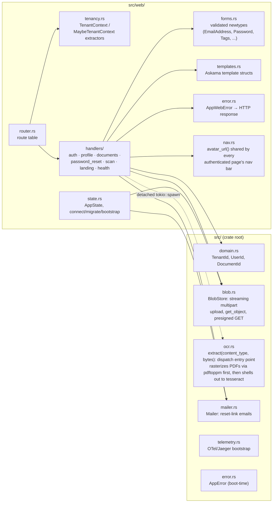
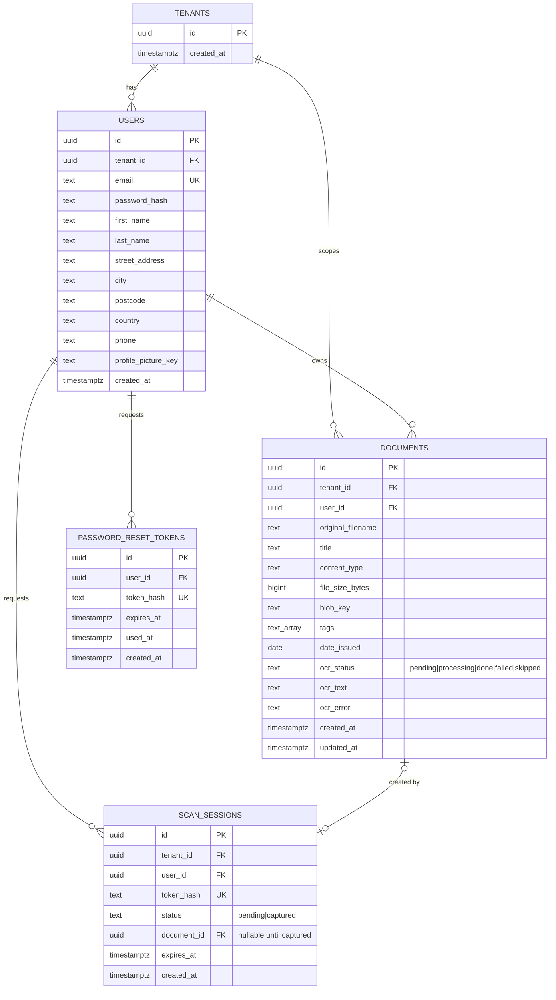

# DocuFlow Architecture

Living reference for the system as a whole — components, interfaces,
frameworks, schema, and the load-bearing decisions behind them. Per-feature
rationale in full (alternatives considered, pros/cons) lives in
[`docs/tdr/`](tdr/); this document summarizes and links out rather than
duplicating it. Update this file whenever a feature changes a component
boundary, adds a table, or reverses an earlier decision — it should always
describe the system as it is today, not as it was designed.

## 1. System context

Everything is server-rendered — no client-side app framework or JSON API;
handlers return HTML (Askama templates) or a redirect. The phone side of
feature 009's scan handoff is no exception: it's another server-rendered
page, just one reached without a session cookie (see §3/§4 below).

## 2. Core stack

| Concern | Choice | Notes |
|---|---|---|
| Web runtime | Axum 0.7 + Tokio | pins `matchit` 0.7's `:param` route syntax, **not** axum 0.8's `{param}` — see [Gotchas](#6-known-gotchas) |
| Templates | Askama 0.14 + `askama_web` | compile-time-checked `.html` templates in `templates/` |
| Database | PostgreSQL + SQLx 0.8 | compile-time verified queries (`sqlx::query!`/`query_as!`); offline cache in `.sqlx/` |
| Sessions | `tower-sessions` + `tower-sessions-sqlx-store` | Postgres-backed server-side sessions; self-migrates its own table |
| Auth | `argon2` | password hashing only — no OAuth/SSO yet |
| Blob storage | `aws-sdk-s3` against LocalStack (dev) / real S3 (prod) | same code path both ways, chosen via env vars only |
| OCR | `tesseract` CLI via `tokio::process::Command` | shelled out, not an FFI crate — `tesseract-ocr` apt package in `Dockerfile`'s runtime stage, zero new Cargo dependency |
| PDF rasterization | `pdftoppm` (`poppler-utils`) CLI via `tokio::process::Command` | same "shell out, don't link" precedent as `tesseract`; rasterizes each page to a PNG, then each page goes through the existing image-OCR path — see TDR 010 |
| QR codes | `qrcode` crate, `svg` feature only | pure Rust, no system dependency; renders inline `<svg>` colored via `var(--ink)`/`var(--paper-raised)` so it follows the page's theme |
| Mail | `lettre` over SMTP | Mailpit in dev, real relay in prod, selected by `SMTP_INSECURE` |
| Telemetry | `tracing` + `tracing-opentelemetry` + OTLP/gRPC → Jaeger | see [§5](#5-telemetry) |
| Errors | `thiserror`, two-tier: `AppError` (boot) / `AppWebError` (request) | zero `.unwrap()`/`.expect()`/`panic!()` in request-handling code, per CLAUDE.md |
| Version control | Jujutsu (`jj`), colocated git backend | never `git add` directly — see `docs/` environment notes in project memory |

## 3. Components

- **`router.rs`** splits routes into a `pages` group (public) and a
  `protected` group. `protected` has `TenantContext` mounted as
  `route_layer` middleware — structural enforcement, not a per-handler
  convention (a new protected route can't accidentally ship
  unauthenticated even if its handler forgets to name `TenantContext` as a
  parameter).
- **`tenancy.rs`** is the one place a request's identity is established.
  `TenantContext` hard-rejects (redirect to `/login`) when there's no
  session; `MaybeTenantContext` is the soft counterpart used on public
  pages just to decide what the nav bar shows.
- **`forms.rs`** hand-rolls validation newtypes (`TryFrom<String>`) rather
  than adopting a validation-framework crate — deliberate, see TDR 003 §2
  (Alternatives G/H/I).
- **`nav.rs`** centralizes the avatar-lookup-and-presign logic so every
  template struct across five+ handlers doesn't reimplement it.
- **`handlers/scan.rs`** (feature 009) is the one place a request reaches a
  document-creating handler *without* going through the `TenantContext`
  extractor — `GET /scan/:token` and `POST /scan/:token` sit in the public
  `pages` router group (a phone never has a session cookie), and resolve
  tenancy from the `scan_sessions` row a hashed path token matches instead.
  `handlers::documents` exposes `store_and_queue_ocr`/
  `insert_document_and_queue_ocr` (split so `documents::create`'s
  "metadata after the file field is rejected" guarantee still holds) as the
  shared blob-upload-plus-DB-insert-plus-OCR-spawn core both this and the
  desktop `POST /documents` handler call — one pipeline, two entry points.

## 4. Database schema

Notes:
- **Tenancy is 1:1 today**: signup mints one `tenants` row and one `users`
  row sharing a single UUID in one transaction. `TenantId`/`UserId` stay
  distinct Rust types anyway (per CLAUDE.md's type-driven-constraints
  rule), so a future many-users-per-tenant migration only has to relax an
  invariant, not reshape the schema or retrofit types across the codebase.
  Full alternatives considered: TDR 003 §2 (Alternatives D/E/F).
- `documents.tags` is a native Postgres `text[]` with a GIN index
  (`documents_tags_idx`), queried via the `&&` (overlap) operator — chosen
  over a join table for simplicity at current scale.
- `documents`'s `ocr_status`/`ocr_text`/`ocr_error` columns were added in
  Feature 1 (the `/documents` list/detail page) ahead of Feature 2 (upload
  + OCR, now built) needing them, so Feature 2 required no schema
  migration — just a writer for columns that already existed. All five
  accepted content types (`image/jpeg`/`png`/`tiff`/`webp` and, since
  feature 010, `application/pdf`) go through `'pending'` → `'processing'`
  → `'done'`/`'failed'`; `'skipped'` is now only a historical value for
  PDF rows uploaded before feature 010 shipped (never assigned to new
  uploads).
- `scan_sessions` (feature 009) follows `password_reset_tokens`'s shape —
  only `token_hash` is ever persisted, never the raw token embedded in the
  QR code. Unlike `password_reset_tokens`, expiry (`expires_at`, a fixed
  10-minute TTL from creation) is enforced entirely in each query's `WHERE`
  clause (`status = 'captured' or expires_at > now()`) rather than compared
  against `time::OffsetDateTime::now_utc()` in Rust, avoiding any
  app/DB-clock-skew concern. `document_id` is `null` until a phone actually
  captures a photo, at which point it and `status = 'captured'` are set
  together in the same `UPDATE` — `handlers::scan` treats "captured but no
  `document_id`" as an invariant violation (`AppWebError::
  InconsistentScanSession`) rather than something that can legitimately
  happen.
- A session table also lives in this database, but it's owned and
  self-migrated by `tower-sessions-sqlx-store` (`PostgresStore::migrate()`)
  — it has no entry under `migrations/` and no corresponding Rust struct.
- The integration test suite runs against its **own** `doc_manager_db_test`
  database (`tests/common/mod.rs::test_database_url`, override with
  `TEST_DATABASE_URL`) — created automatically on first run, on the same
  Postgres server as dev but deliberately never derived from `DATABASE_URL`.
  Tests truncate `users`/`tenants` (cascading to everything FK'd off them)
  at the start of every test, but only in this dedicated database — a
  `cargo test` run can no longer wipe real signed-up accounts sitting in
  the dev/Docker-deployed database. (This used to be a single shared
  database — fixed after it caused exactly that data loss during this
  project's Feature 2 development.)

## 5. Telemetry

- `tracing` + `tracing-opentelemetry` export spans via OTLP/gRPC to Jaeger
  (`:4317` ingest, `:16686` UI).
- `tenant.id`/`user.id` are set as **span attributes** (not raw OTel
  Baggage) inside `TenantContext::from_user_id` — Baggage's `Context` guard
  is `!Send` and unsound to hold across an async handler's `.await` points
  on a multi-threaded runtime, and raw Baggage propagation alone doesn't
  surface as visible Jaeger tags without an extra baggage-to-span-attribute
  processor anyway. Every span nested under the `protected` router
  inherits these attributes automatically.
- PII (payment values, contract text, raw file bytes) is kept out of spans
  by convention: `#[tracing::instrument(skip(...))]` on any handler/method
  taking such a parameter, plus manually-redacted `Debug` impls on
  sensitive newtypes (`Password`, etc.).

## 6. Known gotchas

Operational quirks worth knowing before debugging something that looks
like a code bug but isn't — kept here since they're about the deployed
system, not any one feature's design.

- **axum 0.7 / matchit 0.7 route syntax is `:id`, not `{id}`.** Using the
  axum-0.8-style `{id}` silently 404s for everyone (owner included) instead
  of failing to compile — caught once already in `router.rs` for
  `/documents/:id`.
- **`cargo test` truncates the shared dev database** — see schema notes
  above.
- **`/static` assets are cached `immutable, max-age=31536000`** by the
  Docker image's response headers — a hard refresh (not just a normal
  reload) is required to see CSS/template changes reflected after a
  rebuild.
- **Docker doesn't pick up source changes automatically** — rebuild with
  `docker compose build app && docker compose up -d app` after any change
  before manual verification.
- **`SQLX_OFFLINE=true` Docker builds only compile the release bin**, not
  test binaries — `cargo sqlx prepare --workspace` (no `--tests`) is
  sufficient for the image to build; test binaries run online against a
  live database instead (see the dedicated test database note above).
- **A document's OCR pass can get stuck at `ocr_status = 'processing'`**
  if the app restarts mid-job — axum's graceful shutdown only drains
  in-flight HTTP connections, not the detached `tokio::spawn` task running
  `tesseract`. `state::migrate` sweeps any `'processing'` row back to
  `'pending'` on boot, but that only clears the stuck flag; there's no
  retry yet, so a swept row just sits at `'pending'` until a future retry
  feature exists. This also assumes a single running instance — it would
  incorrectly steal another live instance's in-flight row if this app is
  ever horizontally scaled.
- **`/scan/:token` is deliberately outside the `protected` router group** —
  don't "fix" this by moving it under `TenantContext`'s `route_layer`; the
  phone loading it is never logged in, by design (see TDR 009). Tenancy for
  those two routes comes from the `scan_sessions` row the path token
  resolves to, checked by hand inside `handlers::scan`.
- **`tesseract-ocr` and (since feature 010) `poppler-utils` are
  host/system dependencies, not Cargo ones** — the Docker runtime image
  installs both via `apt-get` (see `Dockerfile`), so the containerized app
  needs nothing extra. Anyone running the app or `cargo test`/`cargo run`
  *outside* Docker needs `tesseract-ocr` and `poppler-utils` (for its
  `pdftoppm` binary) installed on their own machine, or the relevant
  document-upload OCR test soft-skips (checks `which tesseract`/
  `which pdftoppm` first) and any real upload's `ocr_status` will sit at
  `'processing'`/never advance.

## 7. Feature-by-feature decision log

Full write-ups (alternatives evaluated, pros/cons, OTel implications) are
in `docs/tdr/`; this is an index with the one-line "why" for each, newest
first.

| Feature | TDR | Chosen approach | Why (one line) |
|---|---|---|---|
| PDF OCR | [010](tdr/010_pdf_ocr_design.md) | Shell out to `pdftoppm` (poppler-utils) to rasterize each page, then run the existing `tesseract` image-OCR path per page | Stays consistent with the `tesseract` precedent (CLI tool over native-library binding); avoids a second, inconsistent way of vendoring a native PDF dependency |
| Phone-camera scan handoff | [009](tdr/009_phone_camera_scan_design.md) | Single-use hashed `scan_sessions` token in a QR code; native `<input capture>` on the phone, not WebRTC; `<meta refresh>` polling, not JS | No new client-side JS anywhere in the app; reuses the `password_reset_tokens` token pattern and the OCR-status `<meta refresh>` idiom instead of inventing new ones |
| Document upload + OCR | [008](tdr/008_document_upload_design.md) | Shell out to the `tesseract` CLI via detached `tokio::spawn` (not an FFI crate, not a job-queue table) | Zero new Cargo dependency, matches the existing fire-and-forget mail-send pattern and CLAUDE.md's "decoupled... Tokio background green threads" wording exactly |
| Documents dashboard (list/search/sort/edit) | [007](tdr/007_documents_dashboard_design.md) | Literal per-sort-mode `sqlx::query_as!` (5 branches) rather than a dynamically built `ORDER BY` | Preserves CLAUDE.md's compile-time-verified-query guarantee; accepted some duplication as the tradeoff |
| Forgot / reset password | [006](tdr/006_forgot_password_design.md) | Single-use hashed token in `password_reset_tokens`, emailed via Mailpit/SMTP | Standard token-invalidation semantics; avoids storing raw tokens at rest |
| Authenticated nav (avatar, logout) | [004](tdr/004_authenticated_nav_design.md) | `nav.rs` shared avatar-lookup helper reused by every template struct | One presign/lookup path instead of five duplicated ones |
| User profile + S3 picture upload | [005](tdr/005_user_profile_design.md) | Streaming multipart → S3 multipart upload API, presigned GET for display | Bounded memory regardless of file size; bucket never made public |
| Postgres-backed auth, sessions, tenancy | [003](tdr/003_auth_persistence_design.md) | `tower-sessions` + `tower-sessions-sqlx-store`; 1:1 `tenants`/`users` from day one | Server-side revocable sessions (a signed cookie alone can't support logout invalidation); tenancy type distinction cheap now, expensive to retrofit later |
| Landing page + OTel bootstrap | [000](tdr/000_landing_page_design.md)–[002](tdr/002_landing_page_html_design.md) | Askama server-rendered HTML; OTLP/gRPC to Jaeger from process start | Establishes the design system and telemetry pipeline before any feature needs either |

## 8. Deferred / future work

Explicitly scoped out of what's built so far, to avoid being mistaken for
gaps:
- **OCR retry** — a document stuck at `ocr_status = 'failed'` (or reset to
  `'pending'` by the boot-time stuck-`'processing'` sweep) has no
  automatic or manual retry path yet.
- **Multi-page / batch scan capture** — feature 009's phone-camera scan
  handoff produces exactly one document per QR code; scanning a multi-page
  document means repeating the flow per page.
- **Multi-user tenants** (invite flow, membership roles) — schema/types
  already distinguish `TenantId`/`UserId` in anticipation, but no UI or
  membership table exists.
- **Retroactive PDF reprocessing** — PDFs uploaded before feature 010
  shipped keep `ocr_status = 'skipped'` forever; they are not
  automatically re-queued for the now-available PDF OCR pass. Folds into
  the OCR retry item above once that exists.
